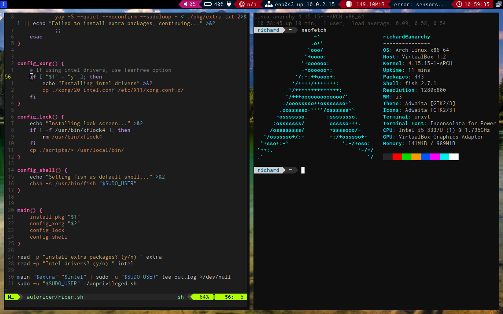

# Automatic Arch Linux ricing scripts

## Usage
The script assumes a state of installation of Arch Linux after the guide in the Archwiki.
It can be executed as **root**, and will ask if you want to create a user. If this is not the case, it will prompt for a username. If the script is executed with **sudo**, the script will use the user that executed sudo (if it is not root).
install packages, but still know what home directory to put the configurations in.

The scripts will install my personal configuration of Arch Linux:
* **i3-gaps** with **betterlockscreen**
* **rxvt-unicode-patched** with **Inconsolata for Powerline** and a custom theme
* **fish** with **omf** and **bobthefish**
* **bumblebee-status**
* **mpd** with **ncmpcpp**
* **rofi** instead of dmenu
* **xfce4-power-manager**
* **NetworkManager**
* Custom scripts for updating xrandr, shutdown, locking and exiting i3

## The code
The code is divided in two scripts: 
* **install.sh** which has to be executed with sudo, and installs packages and copies custom scripts to /usr/local/bin/
* **config.sh** which puts configurations into the home directory

The packages installed by install.sh are in the pkg/ subdirectory. 
The packages in pkg/packages.txt will be installed, if the user wants to install extra packages, 
the packages in pkg/extra.txt will be installed as well. The file pkg/makepkg.conf is a template where the real number of cores + 1 will be inserted into the MAKEFLAGS variable.

The other directories are just there to seperate the different configuration files.

## Screenshots

